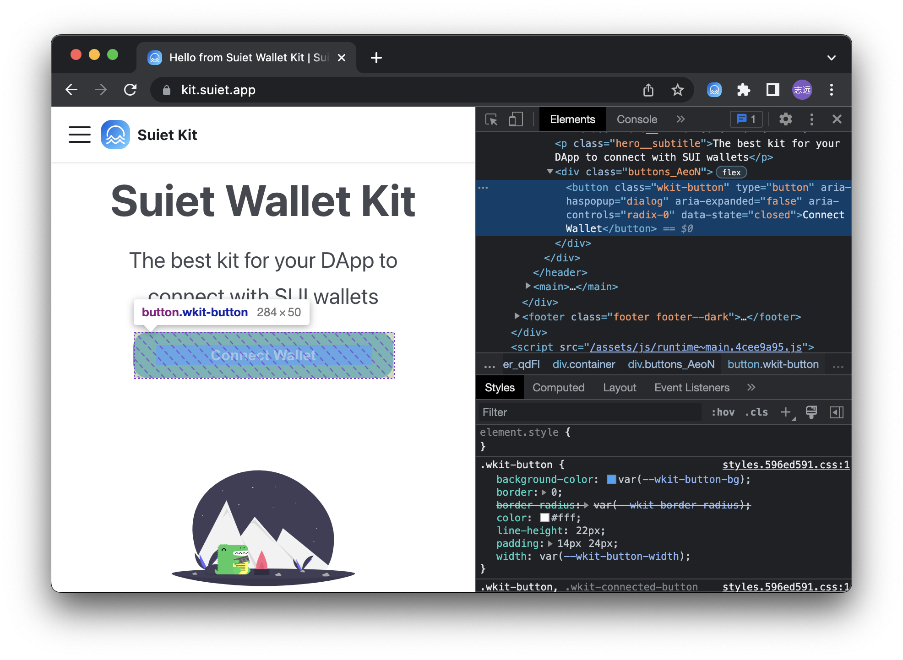

# CSS Customize & Theme

## CSS Variables

This section describes how to use CSS variables to customize the theme of the components.

We use CSS variables to define colors and other styles like below:

```css
:root {
  --wkit-accent-hs: 210, 100%;
  --wkit-on-accent-rgb: 255, 255, 255;
  --wkit-bg-rgb: 239, 241, 245;
  --wkit-on-bg-rgb: 10, 14, 34;
  --wkit-font-family: 'Inter', sans-serif;
  --wkit-font-family-mono: 'IBM Plex Mono', monospace;
  --wkit-font-size-large: 18px;
  --wkit-font-size-medium: 16px;
  --wkit-font-size-small: 14px;
  --wkit-line-height-large: 22px;
  --wkit-line-height-medium: 20px;
  --wkit-line-height-small: 17px;
  --wkit-button-width: 284px;
  --wkit-border-radius: 16px;
}
```

Below is a list of all CSS variables that you can use as public API to customize the look of the components.

| CSS Variables               | Descriptions                                           | Default Value                |
| --------------------------- | ------------------------------------------------------ | ---------------------------- |
| `--wkit-accent-hs`          | The hue and saturation components of the accent color. | `210, 100%`                  |
| `--wkit-on-accent-rgb`      | The RGB value of the color on the accent color.        | `255, 255, 255`              |
| `--wkit-bg-rgb`             | The RGB value of the background color.                 | `239, 241, 245`              |
| `--wkit-on-bg-rgb`          | The RGB value of the color on the background color.    | `10, 14, 34`                 |
| `--wkit-font-family`        | The font-family of the components.                     | `'Inter', sans-serif`        |
| `--wkit-font-family-mono`   | The font-family of the components (monospace).         | `'IBM Plex Mono', monospace` |
| `--wkit-font-size-large`    | The font-size of the components (L).                   | `18px`                       |
| `--wkit-font-size-medium`   | The font-size of the components (M).                   | `16px`                       |
| `--wkit-font-size-small`    | The font-size of the components (S).                   | `14px`                       |
| `--wkit-line-height-large`  | The line-height of the components (L).                 | `22px`                       |
| `--wkit-line-height-medium` | The line-height of the components (M).                 | `20px`                       |
| `--wkit-line-height-small`  | The line-height of the components (S).                 | `17px`                       |
| `--wkit-button-width`       | The width of the button.                               | `284px`                      |
| `--wkit-border-radius`      | The border radius of the components.                   | `16px`                       |

Default Values:

After figuring out the CSS variables you want to customize, you can override them in your own CSS file, like below:

```scss title="./suiet-wallet-kit-custom.css"
:root {
  --wkit-accent-hs: 110, 100%; // Redefine the hs (the first two components of hsl) of the accent color

  ... // other CSS variables
}
```

Import the default CSS file and your own CSS file in your application.

:::tip
The CSS variables must be imported / declared **AFTER** the default CSS file.
:::

For example, in the `src/index.jsx` file:

```jsx title="src/index.jsx"
import '@suiet/wallet-kit/style.css';
import './suiet-wallet-kit-custom.css'; // You CSS file here
```

## Override (Not recommended)

When CSS variables are not enough, you can customize the styles by importing the CSS file and overriding our default CSS rules.

:::caution
**Override our default CSS rules is not recommended because it is not easy to maintain.** If you have any questions or feature requests, please contact us.
:::

Fellow the steps below to customize the styles:

First, figure out the CSS class name of the component you want to customize. For example, the CSS class name of the `ConnectButton` component is `wkit-button`.



## CSS Class Names Reference

Below are the CSS class names used by different components that you can customize:

### AccountModal Component

| CSS Class Name | Description |
| --- | --- |
| `wkit-account-modal__content` | Main content container of the account modal |
| `wkit-account-modal__info` | Information section containing name and address |
| `wkit-account-modal__name` | Display name or SuiNS name |
| `wkit-account-modal__address` | Wallet address display |
| `wkit-account-modal__address--primary` | Primary address variant (when no SuiNS name) |
| `wkit-account-modal__actions` | Container for action buttons |
| `wkit-account-modal__action-button` | Individual action button (copy, disconnect) |
| `wkit-account-modal__action-button--disconnect` | Disconnect button variant |
| `wkit-account-modal__action-button-text` | Text inside action buttons |
| `wkit-account-modal__action-button-text--danger` | Danger text variant for disconnect |

### Dialog/Modal Shared Classes

| CSS Class Name | Description |
| --- | --- |
| `wkit-dialog__overlay` | Modal overlay background |
| `wkit-dialog__content` | Modal content container |
| `wkit-dialog__header` | Modal header section |
| `wkit-dialog__title` | Modal title text |
| `wkit-dialog__close` | Close button |

### ConnectModal Component

| CSS Class Name | Description |
| --- | --- |
| `wkit-select__scroll` | Scrollable wallet list container |
| `wkit-select__container` | Wallet section container |
| `wkit-select__title` | Section title (e.g., "Popular", "Others") |
| `wkit-select-item` | Individual wallet item |
| `wkit-select-item__icon` | Wallet icon container |
| `wkit-select-item__icon-img` | Wallet icon image |

### Button Component

| CSS Class Name | Description |
| --- | --- |
| `wkit-button` | Main connect button |

Then override the styles in your own CSS file.

```scss title="./suiet-wallet-kit-custom.css"
.wkit-button {
  height: 64px; // For example, override the height of the button
}

/* Customize AccountModal */
.wkit-account-modal__content {
  padding: 24px 0; // Increase padding
}

.wkit-account-modal__name {
  color: #2563eb; // Change name color to blue
  font-size: 20px; // Increase font size
}

.wkit-account-modal__action-button {
  border-radius: 8px; // Make buttons more rounded
  padding: 12px 16px; // Increase button padding
}

.wkit-account-modal__action-button--disconnect {
  background-color: rgba(220, 38, 38, 0.1); // Custom disconnect button color
}
```

And last, import the default CSS file and your own CSS file in your application.

:::tip
Your CSS rules must be imported / declared **AFTER** the default CSS file.
:::

For example, in the `src/index.jsx` file:

```jsx title="src/index.jsx"
import '@suiet/wallet-kit/style.css';
import './suiet-wallet-kit-custom.css'; // You css file here
```
